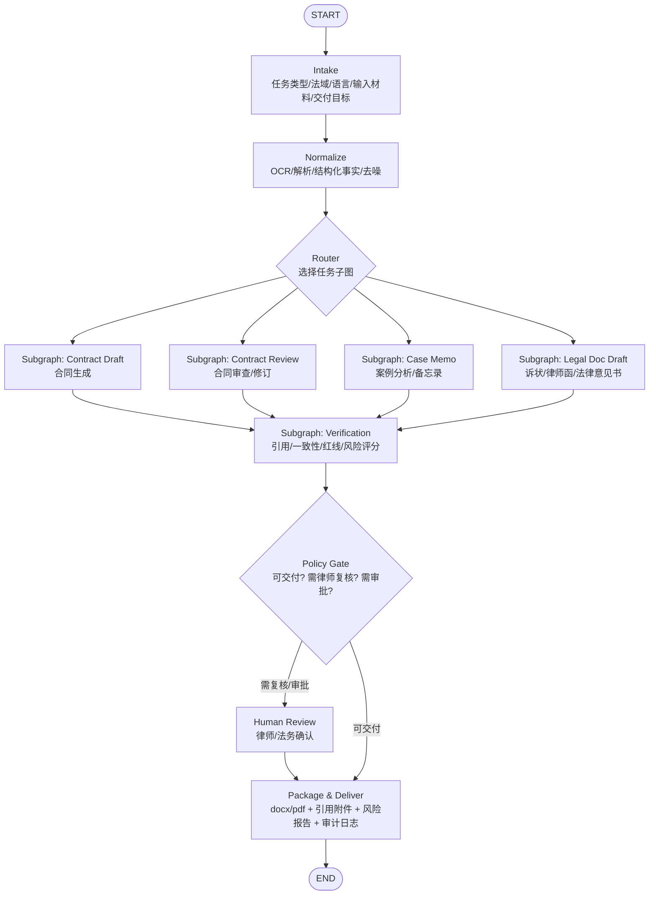
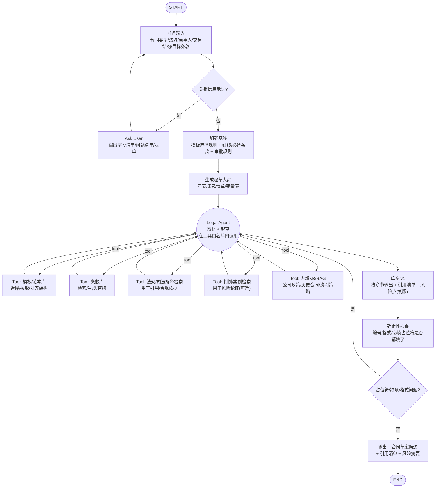
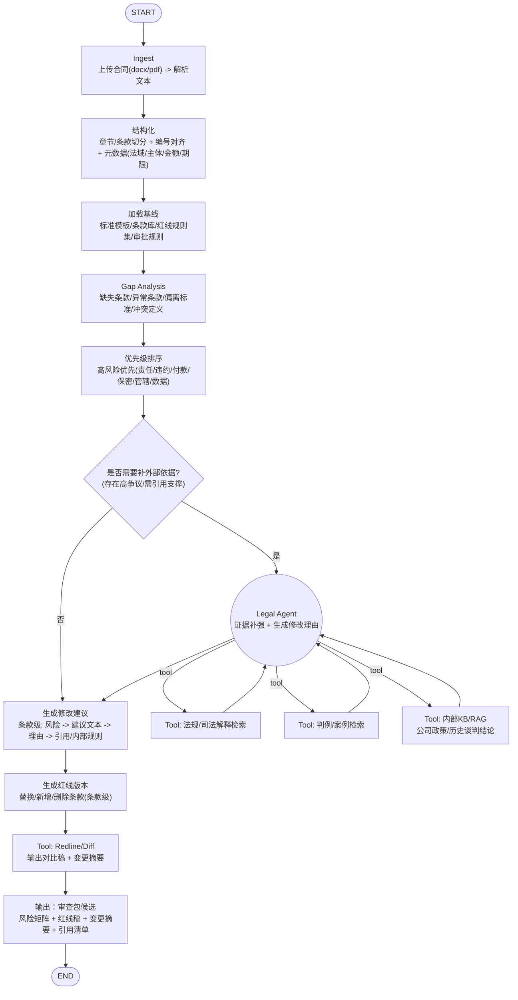
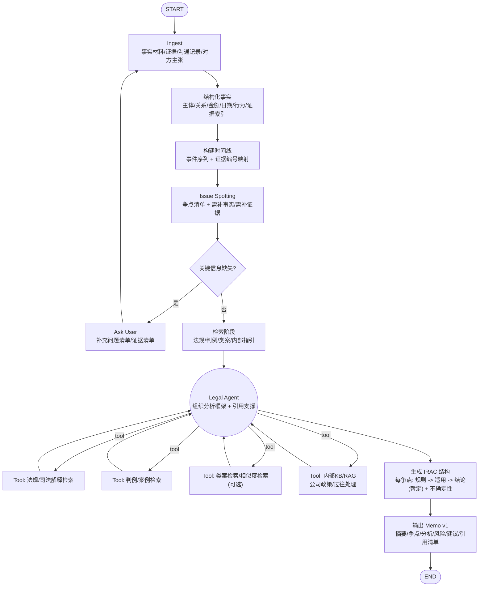
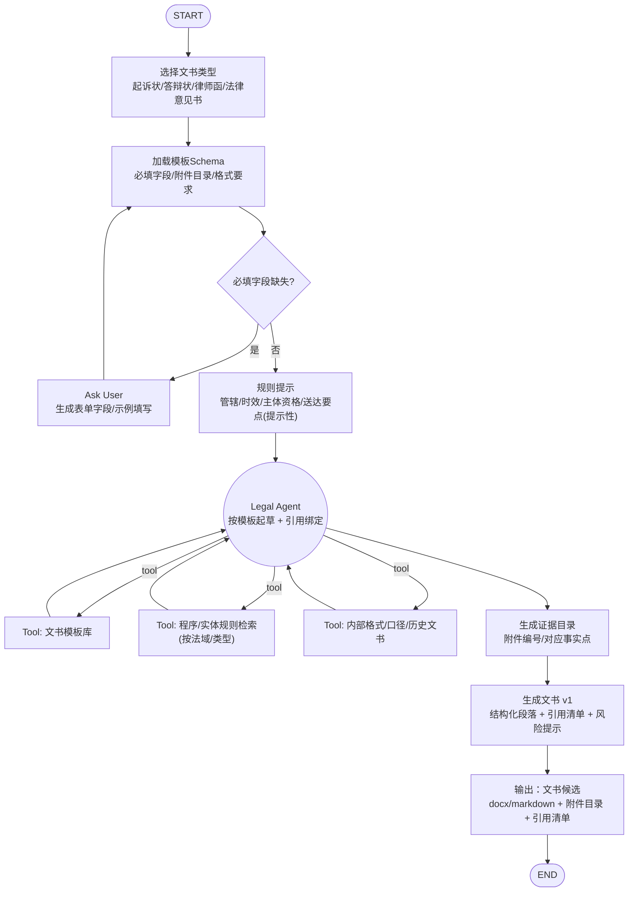
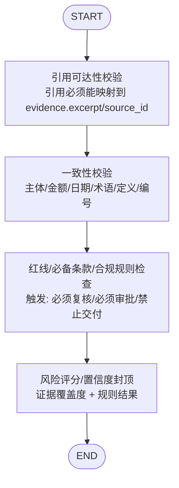

# Legal Agent 图谱参考（草案）

> 本页为设计参考，不代表当前仓库实现已经完整落地；请以各仓库代码与 `architecture/progress.md` 为准。

**法律业务（合同生成/合同审查/案例分析/法律文书生成）**的推荐 AI 架构，并把 **4 条业务链全部展开**成可落地的 LangGraph 图（每条都是“完整链路 + 循环 + 门禁 + 可审计证据”）。

我推荐的是：**Workflow 主导 + 1 个 Legal Agent（负责取材/生成）+ 确定性校验子图 + Policy Gate +（可选）Reviewer sub-agent**。  
（V1 就把 Reviewer 节点去掉；V2 再加 Reviewer。）

---

## 0) 推荐的整体架构（组件分层）
- **LangGraph 编排层**：Router → 任务子图（draft/review/memo/doc）→ 统一 Verification 子图 → Policy Gate → 打包交付
- **Legal Agent**：只在“取材/写作/改写”节点使用；其余尽量确定性节点
- **Tools/Skills 白名单**（举例）  
  - 取材：法规检索、判例检索、内部 KB/RAG、模板库、条款库  
  - 解析：OCR/版面解析、条款切分/编号、实体抽取（主体/金额/日期/法域）  
  - 校验：引用可达性、事实一致性、红线/必备条款、编号/格式、术语一致性  
  - 交付：docx/pdf 导出、红线 diff、引用附件打包、审计日志落库
- **Policy Gate（必备）**：决定“可交付/需律师复核/需审批/拒绝”；高风险输出必须拦住

---

## 1) 顶层 Router 图（总入口）

---

## 2) 子图一：合同生成（Contract Draft）— 全展开

> 合同生成里，“AI 判断用什么工具”主要发生在 `Legal Agent` 节点：  
> 但它的“可选空间”被 **模板/红线/必备条款/缺项检测**这些确定性节点强约束住了。

---

## 3) 子图二：合同审查/修订（Contract Review）— 全展开
目标交付一般是：**风险矩阵 + 条款级修改建议 + 红线版合同 + 引用依据/内部规则依据**。

---

## 4) 子图三：案例分析/备忘录（Case Memo）— 全展开
目标交付一般是：**争点清单 + 时间线 + 规则/判例依据 + 适用分析(IRAC) + 不确定点/需补事实清单 + 建议路径**。

---

## 5) 子图四：法律文书生成（诉状/答辩状/律师函/法律意见书）— 全展开
目标交付一般是：**结构化文书 + 事实与证据目录 + 管辖/时效/主体资格提示 + 引用/模板来源 + 可交付格式**。

---

## 6) 统一的 Verification（确定性校验）子图（建议所有任务共用）
你可以把下面这个作为一个真正的 LangGraph subgraph，在 4 个业务子图后统一调用：

---

## 7) 你最终“推荐落地”的版本（一句话）
先用：**V1 + 统一 Verification + Policy Gate** 把链路跑通；  
法律业务我建议你直接上 **V2（加一个 Reviewer 节点/子 agent）**做质量保险，但不要一开始就拆 Researcher/Drafter 多 agent。

如果你愿意，我下一步可以把这套“全部展开”的图，进一步落成：  
- 每个节点的 `State` 输入输出 schema（Pydantic）  
- tools/skills 的接口定义（含引用证据结构、hash、可回放）  
- Policy Gate 的规则样例（哪些情况必须律师复核/必须审批/禁止交付）
