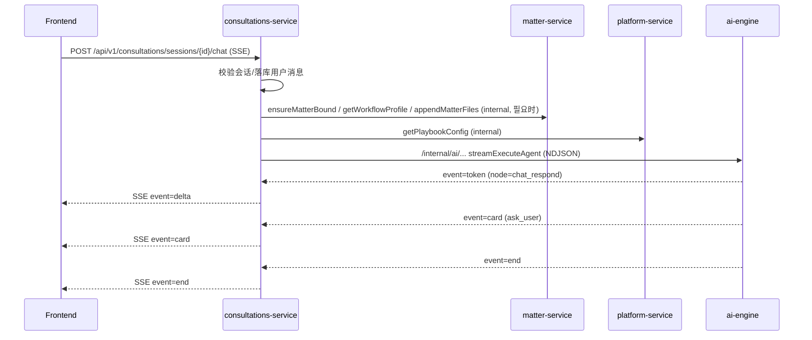
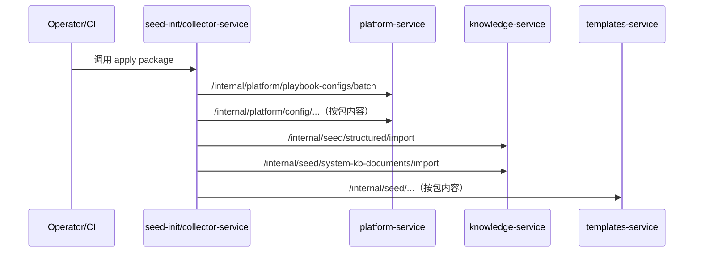

# 数据流与协议（SSE / NDJSON / Internal API）

本页描述系统的关键数据流，重点覆盖：

- 对话流：前端 SSE ↔ AI 引擎 NDJSON
- 状态流：事项/对话状态如何存储与同步
- 知识流：seed → 写入 → 索引 → 检索（原子检索/GraphRAG）
- 记忆流：事实写入/查询（抽取能力当前为占位）

## 1) 对话流（Consultations → AI Engine）

### 1.1 时序（简化）

### 1.2 协议要点

#### 前端 → consultations-service：SSE

- Content-Type：`text/event-stream`
- consultations-service 将内部 NDJSON 事件转换为前端可消费的 SSE 事件：
  - `delta`：用户可见 token 增量（仅转发 `node=chat_respond` 的 token，避免内部推理串流到前端）
  - `card`：卡片交互（中断/补问/选择/确认）
  - `end`：结束

#### consultations-service → ai-engine：NDJSON

- Content-Type：`application/x-ndjson`
- ai-engine 输出逐行 JSON：`{"event":"...", "data":{...}}`
- 典型事件：`token`、`progress`、`card`、`result`、`error`、`end`

## 2) 状态流（Session / Matter / Thread）

系统有三类关键状态：

### 2.1 Session（consultations-service）

- 存储：consultations-service 的数据库（实体：session/message/attachment 等）
- 作用：承载咨询态对话上下文；必要时绑定/升级到 Matter

### 2.2 Matter（matter-service）

- 存储：matter-service 的数据库（实体：matter、todo、phase progress、analysis version 等）
- 作用：承载“事项态”工作流（Playbook phases、todos、结构化产物）

### 2.3 Thread State（ai-engine）

- 存储：ai-engine 使用 Postgres 的 checkpointer（LangGraph checkpoint）
- 作用：承载 agent 图的运行状态，支持中断与恢复（interrupt/human_review）

## 3) Seed 数据流（collector-service）

`collector-service` 的核心职责是把系统资源以“seed package”的形式分发到各服务，典型包括：

- Playbooks（用于事项/咨询流程配置）
- 平台系统资源（business categories、service types 等）
- 知识结构化 seeds（诉讼要素、非诉 checklist、系统 KB 文档清单）
- 模板系统资源（模板/变量/示例）

典型流：

## 4) 知识流（knowledge-service）

### 4.1 写入与索引

knowledge-service 的数据面有两层：

- Source of truth：Postgres（KnowledgeDocument/KnowledgeChunk 等）
- 可重建索引：Elasticsearch（可选；不可用时自动降级为 SQL 检索）

在批量写入（例如内部 atomic 接口 batchUpsert）时：

1. 写入/更新 KnowledgeDocument
2. 重建该 document 的 chunks
3. best-effort：写入 search backend（ES）
4. best-effort：同步 graph（Neo4j；若启用）

### 4.2 检索（原子检索与 GraphRAG）

- 原子检索（Atomic Search）
  - keyword/vector/hybrid 三种模式
  - 优先使用 search backend（ES）；
  - ES 不可用或失败时降级为 SQL keyword/score（可用性优先）
- GraphRAG（Graph + Atomic Search）
  - 先用 graph filters 做结构化约束（可选）
  - 再做 atomic 检索得到 primary
  - 可选：从 graph context 扩展候选 docs，再二次检索并 merge

> 注意：vector 语义检索当前通过 Elasticsearch kNN + OpenAI 兼容 Embedding API 生成向量（不是 Weaviate/Qdrant）。

## 5) 记忆流（memory-service）

memory-service 当前以结构化存储为主：

- MemoryItem：按 scope（SESSION/MATTER/USER）与 item_type（FACT/…）组织
- Facts：支持 create/update/query/search/clear/migrate 等

现状说明：

- `POST /api/v1/memory/extract` 已提供 API 入口，但当前实现为占位（返回空结果）。
- 后续可接入 ai-engine/LLM 做“事实抽取”，并将结果写入 FACT（需明确幂等键与去重策略）。

## 6) Internal API 鉴权与请求上下文

- 内部调用鉴权：`X-Internal-Api-Key`
- 组织/用户上下文：多数 API 支持 `X-User-Id`、`X-Organization-Id`（或 query param 兜底）
- RequestId：建议所有服务透传 `X-Request-Id` 用于链路追踪（`ai-boot-framework` 已内置）
