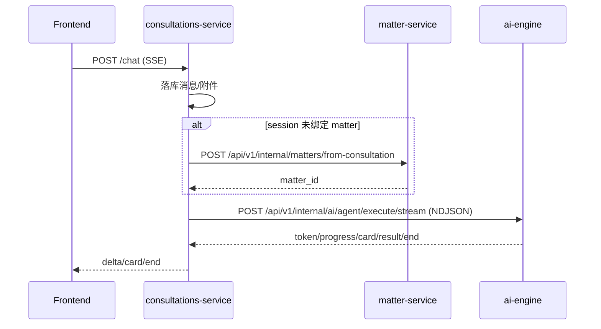
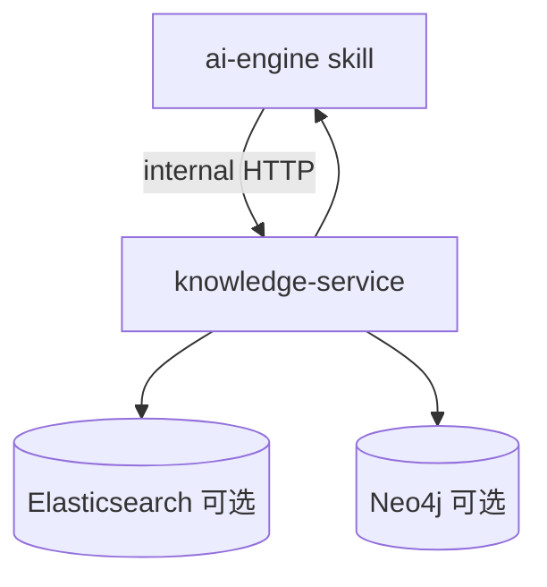
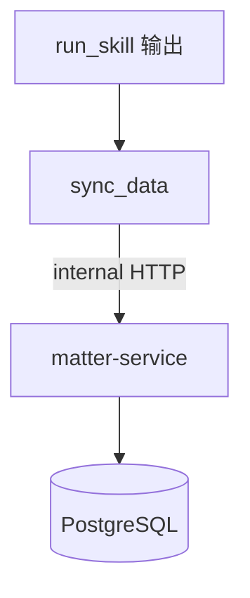

# 数据流架构

本页描述几条核心链路的数据流转方式（以 workbench-mode 为准）。

## 1) 咨询对话（SSE ↔ NDJSON）

- 对前端：SSE（`text/event-stream`）
- 对 ai-engine：NDJSON（`application/x-ndjson`）


```mermaid
sequenceDiagram
  participant FE as Frontend
  participant CONS as consultations-service
  participant MAT as matter-service
  participant AIE as ai-engine

  FE->>CONS: POST /chat (SSE)
  CONS->>CONS: 落库消息/附件
  alt session 未绑定 matter
    CONS->>MAT: POST /api/v1/internal/matters/from-consultation
    MAT-->>CONS: matter_id
  end
  CONS->>AIE: POST /api/v1/internal/ai/agent/execute/stream (NDJSON)
  AIE-->>CONS: token/progress/card/result/end
  CONS-->>FE: delta/card/end
```

卡片中断：

- ai-engine 产出 `event=card` 后结束本轮流
- 前端提交答案走 `/resume`，consultations-service 转发到 ai-engine 的 resume 流

## 2) 知识检索（skill/tool → knowledge-service）


```mermaid
flowchart TD
  A[ai-engine skill] -->|internal HTTP| K[knowledge-service]
  K --> ES[(Elasticsearch 可选)]
  K --> N4[(Neo4j 可选)]
  K --> A
```

说明：具体检索策略（keyword/vector/hybrid、是否内部重排）以 knowledge-service 当前实现为准。

## 3) 事项同步（sync_data → matter-service）

ai-engine 每次执行 skill 后，都会在可中断点前执行 `sync_data`，把结构化产物与决策字段写回 matter-service：


```mermaid
flowchart TD
  S[run_skill 输出] --> SYNC[sync_data]
  SYNC -->|internal HTTP| MAT[matter-service]
  MAT --> P[(PostgreSQL)]
```

## 状态存储（建议视角）

### Session（consultations-service）

会话侧主要存“消息/附件/会话元信息 + matter_id 绑定”，示例：

```json
{
  "session_id": "123",
  "matter_id": "456",
  "user_id": 1001,
  "tenant_id": "org_x",
  "service_type_id": "civil_prosecution",
  "messages": ["..."],
  "attachments": ["..."]
}
```

### Matter（matter-service）

事项侧是真源，存“业务分类 + 结构化产物 + 待办/阶段/交付件”，示例：

```json
{
  "matter_id": "456",
  "matter_category": "litigation",
  "cause_of_action_code": "CIV.CAUSE.CONTRACT.SALE",
  "service_type_id": "civil_prosecution",
  "profile": {"summary": "..."},
  "data": {
    "workbench": {"goal": "case_analysis"},
    "litigation": {"issues": [], "strategies": []},
    "work_product": {"analysis_report": {"format": "markdown", "content": "..."}}
  }
}
```

### Agent checkpoint（ai-engine）

ai-engine 使用 LangGraph checkpointer 在 Postgres 存储 thread state（用于中断恢复与回放）；`thread_id` 通常与 session 绑定并做 namespace 隔离。

## 一致性与幂等（原则）

- ai-engine 是结构化产物的“生产者”，matter-service 是“真源持久化层”。
- 同步接口建议幂等（按 todo_key / deliverable_key 等做 upsert），避免重复写入。
- 路由应幂等：下一步只由当前 state 决定（workbench router）。
