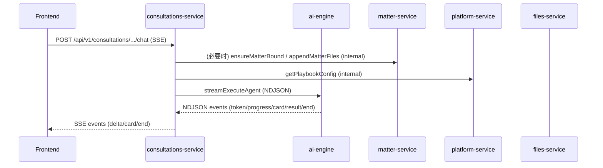

# 微服务拓扑与依赖（以当前代码为准）

本页从“服务职责/调用关系/数据隔离”三个角度描述 LawSeekDog 微服务体系。

说明：

- 入口网关/Ingress 不在本仓库范围内；生产通常由 K8s Ingress 或专用网关承接。
- `gateway-service` 当前更像样板服务（非入口网关），请不要与 ingress/gateway 产品混淆。

## 服务清单（按域划分）

### AI 与资源分发

| 服务/仓库 | 技术栈 | 主要职责 |
|-----------|--------|----------|
| `ai-engine` | Python/FastAPI/LangGraph | Agent 执行、技能编排、NDJSON 事件流、interrupt/human_review |
| `collector-service` | Python/FastAPI | Seed Packages 分发（Playbooks/系统资源/结构化 seeds/运维脚本入口） |
| `shared-libs` | Python | Python 侧 contracts/clients/config/logging（供 ai-engine/collector/工具脚本复用） |
| `lawseekdog-seed-init` | Python CLI | 触发 collector-service internal seed 的轻量工具 |

### 核心业务链路（对话 → 事项）

| 服务/仓库 | 技术栈 | 主要职责 |
|-----------|--------|----------|
| `consultations-service` | Java/Spring Boot | 对话会话、消息、SSE 输出、卡片交互（对接 ai-engine NDJSON） |
| `matter-service` | Java/Spring Boot | 事项/阶段/待办、工作流状态同步、结构化分析结果承载 |
| `platform-service` | Java/Spring Boot | 平台配置：PlaybookConfig、FeatureFlag、Tag、AuditLog 等 |

### 知识/记忆/文档与素材

| 服务/仓库 | 技术栈 | 主要职责 |
|-----------|--------|----------|
| `knowledge-service` | Java/Spring Boot | 知识库：文档/Chunk、原子检索、GraphRAG（ES/Neo4j 可选） |
| `memory-service` | Java/Spring Boot | 记忆条目/事实（当前以结构化存储为主；抽取能力待完善） |
| `files-service` | Java/Spring Boot | 文件元数据、对象存储适配（MinIO/S3）、与事项/用户关联 |
| `templates-service` | Java/Spring Boot | 模板与文书生成（模板版本/渲染/编辑能力接口） |

### 基础域（账号/组织/计费/通知）

| 服务/仓库 | 技术栈 | 主要职责 |
|-----------|--------|----------|
| `auth-service` | Java/Spring Boot | 认证授权、RBAC、Token 签发/校验 |
| `user-service` | Java/Spring Boot | 用户与律师画像（对外查询/管理） |
| `organization-service` | Java/Spring Boot | 组织/律所/成员 |
| `billing-service` | Java/Spring Boot | 订阅/权益/额度（MVP 形态） |
| `notification-service` | Java/Spring Boot | 通知（MVP 形态） |

## 关键调用链（高频）

### 1) 对话链路（SSE ↔ NDJSON）

### 2) 事项链路（Playbook/阶段推进）

- `matter-service` 承载“事项状态”（profile/decisions/data/todos 等）
- `ai-engine` 根据 playbook 与状态决定下一技能，并通过 internal HTTP 对各服务读写

## 服务间调用矩阵（抽象层级）

说明：本矩阵是“高层抽象”（用于理解），不是强约束；以各仓库 `domain/*/external/*Client` 与 `ai-engine` 的 tool 调用为准。

| 调用方 ↓ / 被调用方 → | ai-engine | platform | matter | knowledge | memory | files | templates | user/org/auth |
|----------------------|----------|----------|--------|-----------|--------|-------|-----------|---------------|
| consultations-service | ✓（NDJSON） | ✓ | ✓ | - | - | ✓ | - | ✓（校验/归属） |
| matter-service | ✓ | ✓ | - | ✓ | - | ✓ | - | ✓ |
| templates-service | ✓ | - | - | - | - | ✓ | - | - |
| ai-engine | - | ✓ | ✓ | ✓ | ✓ | ✓ | ✓ | ✓（按技能需要） |
| collector-service | - | ✓ | - | ✓ | - | - | ✓ | - |

## 数据库与数据隔离

当前策略：每个 Java 服务独立数据库（模板默认 PostgreSQL + Flyway）。

备注：

- `ai-engine` 侧也使用 Postgres（LangGraph checkpoint + 执行 trace 等）。
- 统一的“跨服务一致性”主要通过 internal HTTP 调用与幂等写入实现（而不是跨库事务）。

## 外部依赖（当前/可选）

| 组件 | 使用方 | 状态 |
|------|--------|------|
| PostgreSQL | 所有 Java 服务、ai-engine | 已实现（模板默认） |
| MinIO/S3 | files-service | 已实现（适配层） |
| Elasticsearch | knowledge-service | 可选（search backend），不可用时降级到 SQL |
| Neo4j | knowledge-service | 可选（GraphStore），不可用时 fail-open 降级 |
