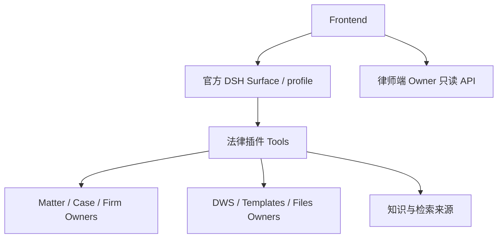

# 微服务拓扑与依赖

```mermaid
flowchart TB
  F[Frontend] --> D[官方 DSH Surface / profile]
  F --> R[律师端 Owner 只读 API]
  D --> L[法律插件 Tools]
  L --> M[Matter / Case / Firm Owners]
  L --> W[DWS / Templates / Files Owners]
  L --> K[知识与检索来源]
```

每个 Owner 在自己的事务内鉴权并校验精确身份、版本和幂等。插件只使用受保护的 typed API；跨 Owner 调用不是分布式原子事务。职责表见[架构边界](../LAWSEEKDOG-ARCHITECTURE-BOUNDARIES.md)，不在此重复维护第二份 Owner 清单。

部署拓扑与可用服务集合从 `infra-live/deploy/runtime-topology.v5.json` 和 `scripts/runtime_topology_contract.py` 读取。远端 runtime 为 `remote-cluster`，腾讯云与阿里云是分别选择的部署目标；目标域名、地址和私有配置不能从旧文档猜测。本地调试仅使用 topology 允许的服务及 lease-aware 生命周期脚本。

本图是调用职责示意，不是已部署 Pod 清单或健康报告；现场状态须按该次发布的精确目标和提交读回。
