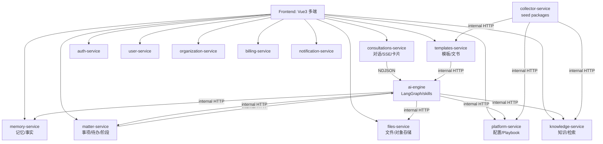
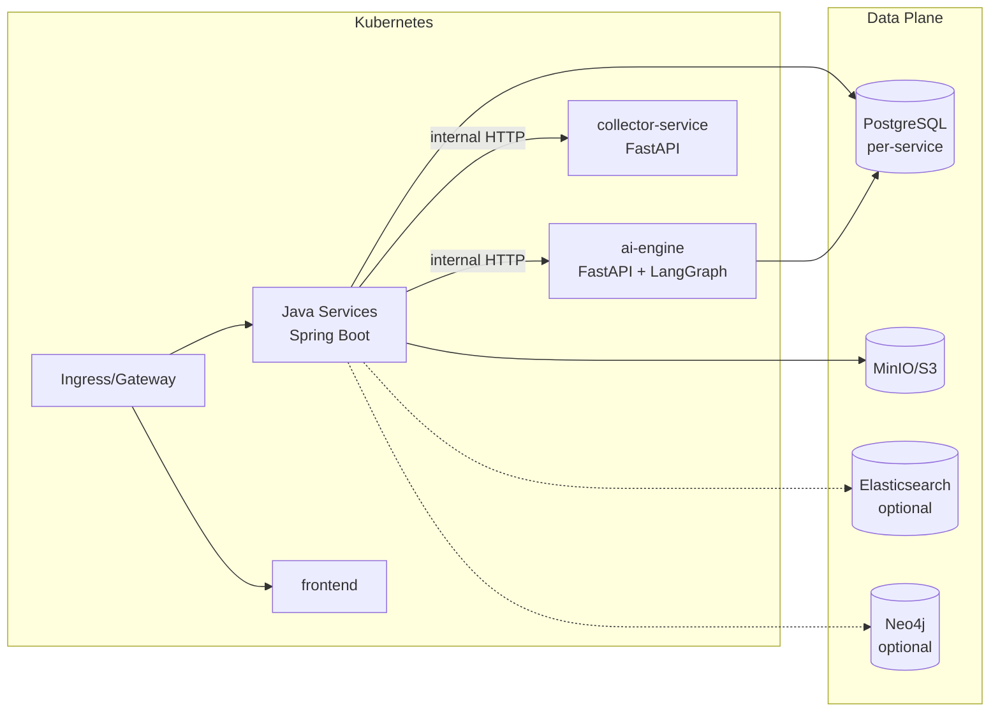

# 系统架构概览（以当前实现为准）

本页描述 LawSeekDog 当前的整体架构与技术选型，并明确哪些能力“已落地/部分落地/规划中”。

## 架构形态

- 业务微服务：Java 21 + Spring Boot（基于 `ai-boot-framework` 的统一工程骨架）
- AI 执行引擎：Python + FastAPI + LangGraph（skills + playbooks 驱动）
- 种子分发：`collector-service` 负责把系统资源/Playbooks/结构化 seeds 推送到各服务的 `/internal/**` 接口
- 入口网关：生产通常由 K8s Ingress / API Gateway 产品承接；`gateway-service` 当前更偏“样板/占位”，不应与入口网关混淆

## 业务架构图（概览）



ASCII 兜底（便于 Pages 不渲染 Mermaid 时阅读）：

```
Frontend(Vue3)
  ├─ REST/SSE → consultations-service ── NDJSON → ai-engine(LangGraph)
  ├─ REST     → matter-service  ── internal HTTP ↔ ai-engine
  ├─ REST     → templates-service ─ internal HTTP ↔ ai-engine
  ├─ REST     → files-service
  ├─ REST     → knowledge-service
  ├─ REST     → memory-service
  └─ REST     → platform/auth/user/org/billing/notification

collector-service（seed packages）
  └─ internal HTTP → platform/knowledge/templates/...
```

## 技术架构图（运行时/部署视角）



## 技术选型（现状）

### 后端

| 组件 | 当前实现 | 说明 |
|------|----------|------|
| 业务微服务 | Java 21 + Spring Boot 3.3 | 大多数对外业务能力都在 Java 服务内 |
| AI 执行引擎 | Python >= 3.11 + FastAPI + LangGraph | `ai-engine`，对外提供 internal agent 执行接口（含流式 NDJSON） |
| 数据库 | PostgreSQL + Flyway | 业务服务模板默认 Postgres；各服务独立库 |
| 对象存储 | MinIO/S3 | 由 `files-service` 适配与抽象 |
| 搜索（可选） | Elasticsearch | `knowledge-service` 的检索后端；支持 keyword/vector/hybrid（向量 embedding 走 OpenAI 兼容 API） |
| 图谱（可选） | Neo4j | `knowledge-service` 的 GraphStore；用于 GraphRAG 扩展召回 |

说明（避免误差）：

- 本项目当前未在 Java 服务中引入 Redis 作为硬依赖（以代码为准）。
- 向量检索当前走 Elasticsearch kNN（不是 Weaviate/Qdrant）；旧文档将逐步清理漂移。

### 前端

| 组件 | 当前实现 |
|------|----------|
| 框架 | Vue 3 + TypeScript |
| 构建 | Vite |
| 样式 | TailwindCSS |
| 状态 | Pinia |
| 路由 | Vue Router |
| E2E | Playwright |

### AI

| 组件 | 当前实现 |
|------|----------|
| Agent 框架 | LangGraph（支持 interrupt/human_review） |
| 模型调用 | OpenAI 兼容协议（默认可走 OpenRouter；具体模型以配置为准） |
| 流程配置 | Playbooks（JSON）+ Skills（目录化：`SKILL.md`/schema/scripts） |

## 核心设计原则（工程与协议）

### 1) API 边界：对外与对内严格分离

- 对外 API：`/api/v1/**`
- 对内 API：`/internal/**`（Service-to-Service 调用）
- 内部调用鉴权：`X-Internal-Api-Key`（由部署环境统一注入，Java 与 Python 侧均支持）
- 统一返回体：`ApiResponse<T>` / `PageResponse<T>`

### 2) DDD 分层：避免“业务逻辑散落 Controller”

Java 服务目录约束：

```
api/                # HTTP 协议层
application/        # 应用编排层（事务边界/流程编排）
domain/             # 领域层（实体/值对象/仓储接口）
infrastructure/     # 基础设施（JPA/外部服务实现）
```

### 3) 流式协议：SSE（前端）+ NDJSON（服务间）

- `consultations-service` 对前端使用 SSE（`text/event-stream`）
- `ai-engine` 对服务间使用 NDJSON（`application/x-ndjson`）事件流
- “卡片中断”统一为 `control.action == ask_user`，由服务端停止当前流并等待 `/resume`

### 4) 可观测性与可运维

由 `ai-boot-framework` 统一提供（各服务可按需关闭/收敛）：

- Actuator：默认在 `/internal/actuator`
- Prometheus 指标：通过 Actuator 暴露
- OpenTelemetry：OTLP 输出（生产环境对接 Collector）
- 日志：Log4j2（建议透传 `X-Request-Id`）
