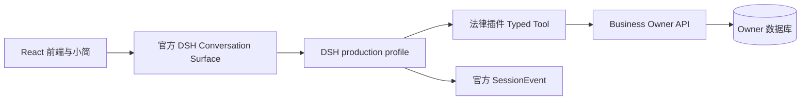

# 系统架构概览

```mermaid
flowchart LR
  F[React 前端与小简] --> D[官方 DSH Conversation Surface]
  D --> P[DSH production profile]
  P --> L[法律插件 Typed Tool]
  L --> O[Business Owner API]
  O --> DB[(Owner 数据库)]
  P --> E[官方 SessionEvent]
```

`ai-engine-v2` 承载该 profile 及插件。Host 验证身份、组织、来源并接入 DSH；Xiaojian 呈现会话、typed 卡片、上传入口和业务链接。二者均不代理法律领域请求或持有业务生命周期。专业页面从 Owner 读取业务结果，不能把聊天完成、流式预览或绿卡片当作落库证据。

业务工作按“入口 → Matter → 成果 → 律师决定”区分。Matter 是工作归属，Case/Proceeding 是案件程序轴，DSH Session 是讨论与执行记录，DWS 是文书草稿和版本单一来源；这些身份与状态不能互相替代。具体 Owner 和三类初始化编排见[架构边界](../LAWSEEKDOG-ARCHITECTURE-BOUNDARIES.md)。

旧 LangGraph workbench、consultations-service 转发链、Run ledger 和 pending-card 不是当前架构。历史页面中的表结构、路由和门禁不得作为新增实现依据。
