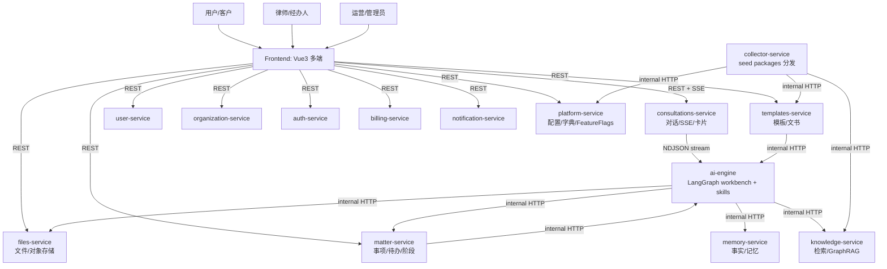

# 系统架构概览

LawSeekDog 是一个智能法律服务平台，采用微服务架构；核心“流程编排”由 `ai-engine` 的 LangGraph workbench 工作流驱动，支持法律咨询、事项管理、文书生成等链路。

## 整体架构（概览）

```mermaid
flowchart TB
  U[用户/客户] --> FE[Frontend: Vue3 多端]
  L[律师/经办人] --> FE
  A[运营/管理员] --> FE

  FE -->|REST + SSE| CONS[consultations-service<br/>对话/SSE/卡片]
  FE -->|REST| MAT[matter-service<br/>事项/待办/阶段]
  FE -->|REST| TPL[templates-service<br/>模板/文书]
  FE -->|REST| FILES[files-service<br/>文件/对象存储]
  FE -->|REST| USER[user-service]
  FE -->|REST| ORG[organization-service]
  FE -->|REST| AUTH[auth-service]
  FE -->|REST| BILL[billing-service]
  FE -->|REST| NOTIF[notification-service]
  FE -->|REST| PLAT[platform-service<br/>配置/字典/FeatureFlags]

  CONS -->|NDJSON stream| AIE[ai-engine<br/>LangGraph workbench + skills]
  MAT -->|internal HTTP| AIE
  TPL -->|internal HTTP| AIE

  AIE -->|internal HTTP| KNOW[knowledge-service<br/>检索/GraphRAG]
  AIE -->|internal HTTP| MEM[memory-service<br/>事实/记忆]
  AIE -->|internal HTTP| FILES
  AIE -->|internal HTTP| MAT

  COL[collector-service<br/>seed packages 分发] -->|internal HTTP| PLAT
  COL -->|internal HTTP| KNOW
  COL -->|internal HTTP| TPL
```

## 技术选型（摘要）

### 后端服务

| 组件 | 技术栈 | 说明 |
|------|--------|------|
| Java 服务 | Spring Boot 3.x + JDK 21 | 业务服务主体（DDD 分层） |
| AI 引擎 | Python + FastAPI + LangGraph | workbench 工作流、skills、NDJSON 事件流 |
| 数据库 | PostgreSQL | 业务数据与 AI checkpoint/trace |
| 缓存/队列 | Redis | 缓存/异步（以当前实现为准） |
| 对象存储 | MinIO/S3 | 文件存储 |
| 搜索 | Elasticsearch（可选） | keyword/vector/hybrid |
| 图存储 | Neo4j（可选） | GraphRAG/关系图 |
| 重排 | rerank-service（可选） | 检索结果重排（当启用时） |

### 前端

| 组件 | 技术栈 |
|------|--------|
| 框架 | Vue3 + TypeScript |
| 构建 | Vite |

## 核心设计原则

- **工作流在 LangGraph**：目标选择、阶段门禁、交付门禁都在 graph/subgraph 表达（playbook-free）。
- **单一统一状态**：统一 `state`（profile/data）+ 白名单校验 + checkpoint，便于回放与审计。
- **确定性优先**：路由/门禁尽量确定性；LLM 主要用于“取材/生成/改写”。
- **人机协同可中断**：关键确认点统一通过卡片（ask_user）中断，`resume` 可继续。
