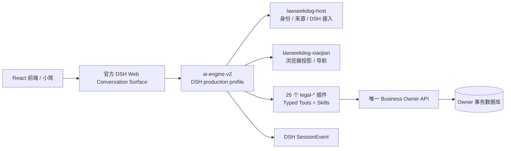

# LawSeekDog 项目总览与文档整理基线

本文是文档站的导航页，记录当前代码工作区的可验证事实，并给出文档和 Agent 指令的整理边界。它不替代服务契约、`AGENTS.md`、共享架构规范或运行验收证据。

基线日期：2026-09-13。

## 一句话定位

LawSeekDog 是一个面向律师工作的多仓库法律业务平台。前端提供律师工作台和小简入口，官方 DSH 承载 Agent、Session、Tool、Question、Approval、Workflow、Subagent、Context 和 Replay，26 个法律插件通过类型化 Tool 调用唯一的业务 Owner API；业务状态留在各 Owner 数据库，Agent 执行事实留在 DSH `SessionEvent`。

## 当前运行链路



`ai-engine-v2` 是 DSH production profile、Host/Client、社区插件和法律插件的工作区，不是自研 Agent Runtime。`lawseekdog-host` 和 `lawseekdog-xiaojian` 都不持有 Case、Matter、Document、Evidence 等业务真相。

## 仓库分组

| 分组 | 仓库 | 当前职责 |
|---|---|---|
| 用户界面 | `frontend` | React + TypeScript + Vite + Tailwind 的律师端工作台；呈现 typed Tool Result 和业务链接 |
| Agent 与插件 | `ai-engine-v2` | 官方 DSH profile、Host、Xiaojian、社区插件、26 个法律插件、契约和 eval |
| 业务 Owner | `firm-service`、`case-service`、`matter-service`、`document-workspace-service`、`templates-service`、`files-service` | 分别持有委托范围、案件程序、事项任务成果、文档生命周期、模板渲染、文件版本与访问边界 |
| 平台与基础域 | `platform-service`、`user-service`、`lawyer-profile-service`、`billing-service`、`notification-service`、`auth-service`、`organization-service`、`quality-service` | 平台配置、身份与组织、画像、账务、通知、质量和鉴权等各自领域 |
| 知识与采集 | `knowledge-service`、`collector-service`、`rerank-service` | 知识素材与来源、采集导入、检索排序；法律结论仍由插件结合来源和业务上下文形成 |
| 工程与交付 | `ai-boot-framework`、`infra-templates`、`infra-live`、`lawseekdog-agent-skills`、`lawseekdog-codex-plugins`、`docs` | Java 脚手架、CI/CD、运行拓扑与发布、共享技能、Codex 插件和文档站 |
| 退役或历史仓库 | `assistant-service`、`memory-service`、`organization-service`、`legal-intelligence-service`（以各仓库 README/AGENTS 为准） | 不能因为目录仍存在就当作当前运行时或新的 Owner；引用前必须核对当前代码和退役说明 |

仓库之间各自独立 Git。发布、远端操作和生产写入的授权不来自本文；相关操作以 `infra-live` 当前 CLI 和运行规范为准。

## 业务真相与写入边界

| 对象 | 唯一 Owner | 约束 |
|---|---|---|
| FirmIntake、Engagement、正式服务范围、利冲 | `firm-service` | 只有正式范围和授权事实来自 Firm；插件不能自行推定委托 |
| Case、Proceeding、程序事件、期限 | `case-service` | 只持有案件和程序真相，不签发 Matter 授权 |
| Matter、Task、Product、交付绑定 | `matter-service` | Matter 表达真实工作范围；Case 分析和 representation 是不同事项身份 |
| Document Workspace 的 draft/review/publish/deliver | `document-workspace-service` | 文书插件不持有文档生命周期；定稿不等于签章或对外提交 |
| 模板、schema、确定性渲染 | `templates-service` | 模板版本和渲染契约独立于 DWS 状态 |
| 文件二进制、revision、checksum、访问边界 | `files-service` | 材料解析不等于证据法律判断 |
| DSH Session、SessionEvent、Question、Approval、Workflow、Subagent | 官方 DSH | 不能在业务服务或插件中再建一套同义控制面 |

合法写入链是：用户意图 → Tool 读取 Owner Context → 精确 mutation proposal → DSH 原生 Approval → Owner 鉴权、OCC、幂等和事务 → typed Owner result → DSH SessionEvent/UI 投影。聊天正文、页面路由、卡片出现或 Session 存在都不能单独证明业务已落库。

## 法律插件如何分工

`legal-materials` 负责材料中有什么，`legal-evidence` 独立判断材料在法律上证明什么；`legal-research` 必须 exact-read 并绑定来源身份、版本和引用；专业插件负责各自领域分析或成果。插件通过 Tool 调用 Owner API，不能直连业务数据库、捏造 receipt、自动 failover 或建立私有运行时。

## 按 GPT-6 Astra 重新整理技能和提示

OpenAI 的 [Rethinking skills and prompts for GPT-6 Astra](https://developers.openai.com/blog/rethinking-skills-and-prompts-for-gpt-6-astra) 建议把技能描述缩短、用渐进披露组织细节、按任务读取 `AGENTS.md`，并重新检查旧模型时代的边界和测试规则。对本项目的落地基线如下：

1. **技能 front matter 只负责路由。** `description` 只说明技能解决什么问题以及准确的触发条件；不要把“涉及数据库/模型/持久化就使用”写成宽泛触发器。
2. **根 `SKILL.md` 做最小路由器。** 复杂流程拆到 `references/`、脚本和测试；进入点告诉 Agent 何时读取哪个资源，不把完整行程和所有历史规则一次塞入上下文。
3. **服务 `AGENTS.md` 只留本地责任、硬边界和最小检查。** 需要架构时读共享规范，需要发布时读运行规范，需要契约时读对应 Owner 文档；不要要求每次改字都读全仓库地图。
4. **任务提示写清完成条件。** 明确目标、范围、成功标准、可用上下文和需要验证的结果；已授权的可逆排查、修复和测试应持续完成，不在第一版实现后提前停下。
5. **模型设置只保留一个真相源。** 运行时 Provider/Model Settings 由 DSH 管理；技能和服务指令不能复制一套模型注册表。旧的 `gpt-5.4`、`gpt-5.6-terra` 等开发代理默认值应清理或改为当前协作规范中的 `gpt-6-astra`，且不能把文档改动误写成运行时模型已切换。
6. **测试按风险校准。** 对低影响、可逆的小改动做必要的窄检查；对 DSH、Owner、契约、发布和法律内容继续执行各自的真实验收。通过静态检查不等于线上链路或法律内容已验收。

## 当前文档漂移清单

已经与当前边界较接近的来源包括：`ai-engine-v2/README.md`、`lawseekdog-agent-skills/workspace-guidance/LAWSEEKDOG-WORKSPACE-GUIDANCE.md`、各活跃服务的 `AGENTS.md`、`docs/LAWSEEKDOG-ARCHITECTURE-BOUNDARIES.md`。

以下文档需要优先复核，因为它们仍描述旧运行时或旧前端：

- `docs/index.md`、`docs/README.md`：仍把 AI Engine 写成 LangGraph 主运行时，把前端写成 Vue 多端。
- `docs/architecture/overview.md`、`docs/architecture/microservices.md`、`docs/architecture/progress.md`：仍以 `ai-engine` + consultations-service 的旧链路作为主架构。
- `docs/implementation/skill-system.md`：仍使用旧 `.skills/`、`skill.meta.json`、统一四段输出和旧 `SkillRunner` 叙述，需要与 DSH skills、Typed Tools 和当前插件目录重新对齐。
- `docs/final-service-architecture.md`：仍把 `assistant-service`、旧 XiaoJian 状态和自研 `ai-engine-v2` runtime 写成活跃 Owner/运行时，应降级为历史记录或删除。

这份清单只标记需要核对的候选，不把“文件存在”当作当前事实。每次更新应以代码、契约、服务 README/AGENTS 和实际验收证据交叉确认。

## 推荐的文档目录

```text
docs/
├── architecture/
│   ├── project-map.md              # 本页：稳定入口和当前总览
│   ├── overview.md                 # 只保留当前运行时架构
│   ├── repositories.md             # 仓库清单和依赖
│   ├── owners.md                   # Owner、状态轴和写入链
│   └── decisions/                  # 经过确认的架构决策
├── flows/                          # 从真实入口到 Owner Result 的业务流程
├── implementation/                 # DSH、插件、契约和前端实现细节
├── deployment/                     # 本地、远端、发布和验收
└── archive/                        # 明确标记的历史设计与迁移记录
```

建议按以下顺序收敛：先更新入口页和架构主图，再修正 Owner/运行链路，随后迁移 skill-system 等实现文档，最后把旧设计移到 `archive/` 并在正文标明“历史”。不要在没有消费者和代码证据时批量改名、升级契约版本或保留兼容分支。

## 信息来源优先级

发生冲突时遵循：用户当前明确指令 → Owner 契约和代码 → `lawseekdog-agent-skills/workspace-guidance` 共享硬约束 → 服务 `AGENTS.md`/README → 本文和其他文档站摘要。运行成功、部署状态、真实对象 ID 和验收结果必须放在带日期的证据产物中，不写成永久架构事实。
