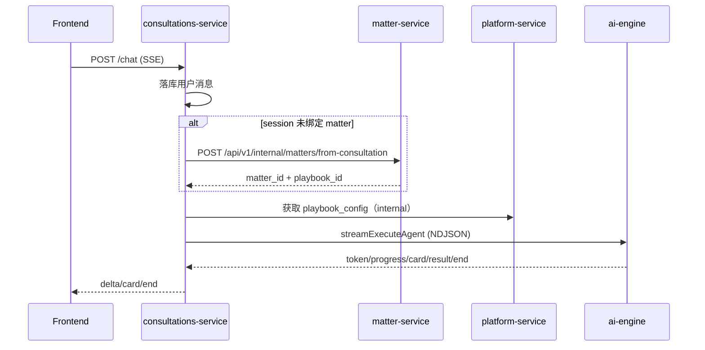

# 咨询 → 事项（Consultation → Matter）

本页描述“用户从一次咨询对话开始，系统如何落库、如何绑定事项、如何进入 Playbook 驱动的流程”的真实链路。

## 现状结论（重要）

当前实现中，“咨询会话”并不是一个完全独立于事项（Matter）的模式：

- `consultations-service` 在对话过程中会 **确保会话绑定一个 matter**（若 session 尚未绑定，会通过 internal 接口创建 matter）
- 创建 matter 后，会自动创建若干初始 todo（例如 intake 收集、律所派单等）
- 后续 AI 引擎执行以 `thread_id`（通常与 session/matter 绑定）推进 playbook 阶段与卡片中断

因此，“咨询 → 事项”更像“咨询态入口 → 自动生成一个 DRAFT 事项 → 按 Playbook 推进”。

## 1) 入口 API（对前端）

以 consultations-service 为入口：

- 创建会话：`POST /api/v1/consultations/sessions`
- 获取会话：`GET /api/v1/consultations/sessions/{id}`
- 发起对话（流式）：`POST /api/v1/consultations/sessions/{id}/chat`（SSE）
- 获取待处理卡片：`GET /api/v1/consultations/sessions/{id}/pending_card`
- 提交卡片并恢复：`POST /api/v1/consultations/sessions/{id}/resume`（SSE）

> 具体入参/返回请以各服务 OpenAPI 为准（见 `api/openapi.md`）。

## 2) 关键链路：首轮对话如何创建 Matter

当 session 尚未绑定 matter 时，consultations-service 会调用 matter-service 的 internal 接口创建事项：

- `POST /api/v1/internal/matters/from-consultation`
- 关键字段：`session_id`、`user_id`、`organization_id`、`title`、`service_type_id`、`file_ids`
- 默认 `service_type_id`：`legal_consultation`（若 session 未指定）

创建成功后：

- consultations-service 将 `session.matter_id` 写回
- matter-service 将 matter 初始化为 `DRAFT`，并创建 intake/派单等初始 todo

## 3) 对话执行：SSE ↔ NDJSON

对话执行采用双层流式：

- 对前端：SSE（`text/event-stream`）
- 对 ai-engine：NDJSON（`application/x-ndjson`）

简化时序：

卡片中断：

- 当 skill 输出 `control.action == ask_user`，ai-engine 会输出 `event=card` 并结束当前流
- 前端提交答案后调用 `/resume`，consultations-service 再转发到 ai-engine 的 resume 流

## 4) 从 DRAFT 到 ACTIVE：事项如何“进入流程”

matter-service 创建 matter 时会创建 intake 相关 todo；在后续对话与技能执行中：

- ai-engine 会通过 internal API 更新事项：
  - 事项画像/决策字段（`profile.*`）
  - 结构化分析结果（例如 `issues`、`strategies`、`evidence_analysis` 等）
  - todo 的 upsert/完成（按 todo_key 幂等）
- matter-service 在满足条件时可将事项推进到下一阶段（由 Playbook gate/checkpoints 决定）

> 具体阶段/技能/门控写法参见 `flows/playbook-phases.md` 与 `implementation/planner-engine.md`。

## 5) 目前仍需要补齐/确认的点（真实状态）

- “咨询模式完全不创建 matter”的能力：当前实现没有；如需要，需要明确与现有 thread_id/状态存储的兼容策略。
- “卡片状态”是存 session 还是存 matter：当前链路既有会话侧 pending_card，也有事项侧 todo；需要在前端/产品层明确“以哪个为准”的体验约束。
