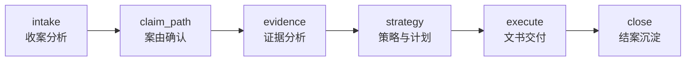

# 诉讼流程（示例：民事起诉 / 原告）

本页以当前 seed playbook `litigation_civil_prosecution` 为例，描述“诉讼事项”在系统中的阶段与技能编排方式。

来源：

- playbook JSON：`collector-service/resources/seed_packages/matters_system_resources/data/playbooks/litigation_civil_prosecution.json`
- 运行时读取：由 `collector-service` 分发到 `platform-service`，再由 `matter-service/consultations-service` 查询并传给 `ai-engine`

## 1) 阶段总览



## 2) 阶段配置要点（摘录）

### 2.1 全局优先规则（priority_rules）

当有新附件且尚未完成文件分类时，优先执行 `file-classify`：

```json
{
  "when": "state.attachment_file_ids.length > 0 && state.files_classified != true",
  "skill": "file-classify"
}
```

### 2.2 各阶段（phases）

| phase.id | 名称 | allowed_skills | gate（门控） |
|----------|------|----------------|--------------|
| `intake` | 收案分析 | `litigation-intake` |（无显式 gate；以 checkpoints + PhaseManager 缺口判断为主） |
| `claim_path` | 案由确认 | `cause-recommendation` | `profile.decisions.cause_confirmed == true` |
| `evidence` | 证据分析 | `evidence-analysis` |（无显式 gate；以 checkpoints/产物字段为主） |
| `strategy` | 策略与计划 | `issue-analysis` / `strategy-planning` | `profile.decisions.strategy_confirmed == true` |
| `execute` | 文书交付 | `documents-todo` / `document-generation` | `profile.decisions.document_reviewed == true` |
| `close` | 结案沉淀 | `knowledge-deposit-todo` | `profile.decisions.knowledge_deposit_done == true` |

> 注意：gate 字段/写法必须满足 `ai-engine` 的 playbook 校验规则；详见 `flows/playbook-phases.md`。

## 3) 卡片交互点（ask_user）

诉讼流程的关键“人工确认点”通常通过卡片完成（统一输出契约为 `control.action == ask_user`）：

- 案由确认：`cause-recommendation` 输出待确认选项，等待律师选择并回填 `profile.decisions.cause_confirmed`
- 策略确认：`strategy-planning` 产出策略与风险评估，等待确认并回填 `profile.decisions.strategy_confirmed` / `selected_strategy_id`
- 文书选择/审核：`documents-todo` 产出可生成文书清单，`document-generation` 产出草稿，等待审核回填 `profile.decisions.document_reviewed`
- 结案沉淀：`knowledge-deposit-todo` 抽取要点并请求确认回填 `profile.decisions.knowledge_deposit_done`

卡片协议与恢复执行参见：`implementation/card-interaction.md`。

## 4) 典型产物（输出字段层面）

在该 playbook 中，常见的数据产物包括：

- `profile.plaintiff / profile.defendant / profile.facts / profile.claims`
- `profile.cause_of_action_code / profile.cause_of_action_name`
- `issues`、`strategies`、`risk_assessment`
- `documents`（文书产物集合）

这些字段的“写入/同步”通常由 `ai-engine` 通过 internal HTTP 调用 matter-service 的相关接口完成（或由业务服务在接入层落库）。

## 5) 知识库关联（knowledge_bases）

该 playbook 绑定了默认可检索的知识库集合：

```json
"knowledge_bases": ["sys_cases", "sys_laws", "sys_interpretations", "sys_writing_guides"]
```

具体检索行为取决于技能实现（skills 内会选择是否调用 knowledge-service 的原子检索/GraphRAG 接口）。
