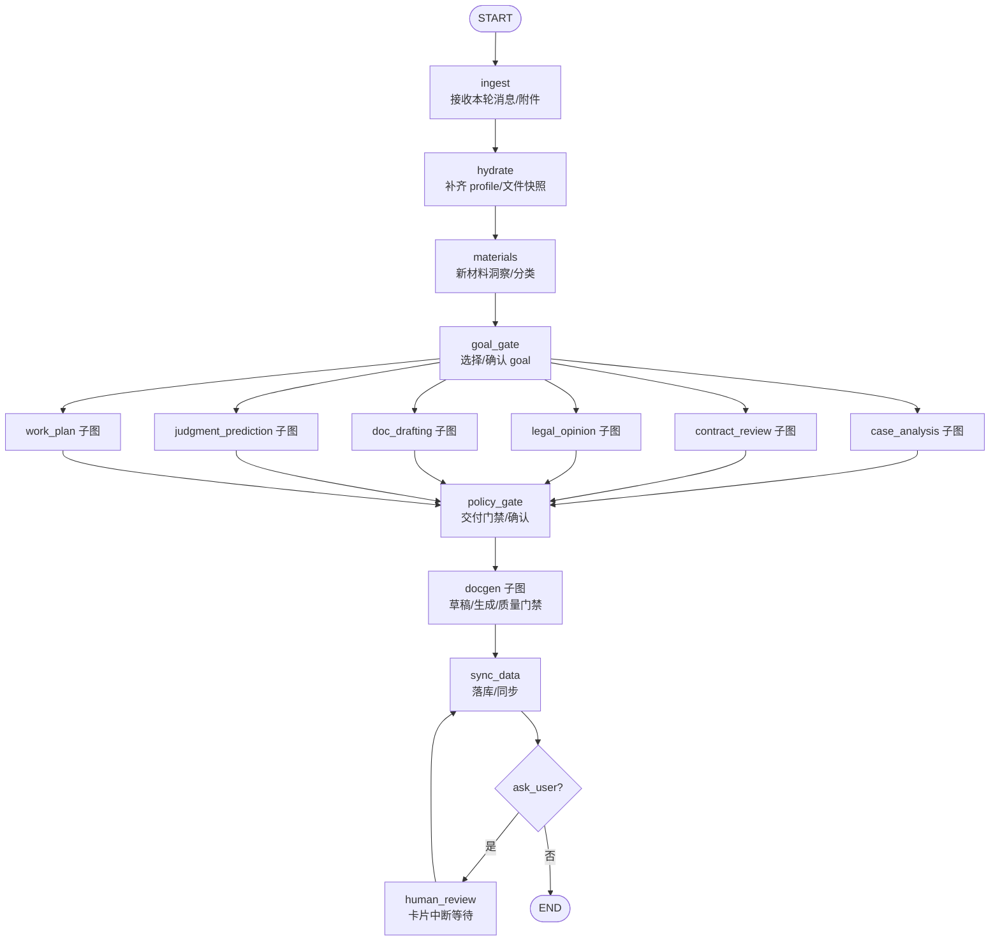

# 工作台目标与工作流（Workbench / LangGraph）

当前主链路采用 **LangGraph 工作流编排（workbench-mode）**：流程在代码中以 graph/subgraph 形式定义，运行时根据状态做确定性路由与门控；不再依赖 Playbook 作为“外部流程 DSL”。

## 1) 目标（Goal）是什么

Workbench 把“本轮要完成什么”显式建模为 `data.workbench.goal`（粘性字段）。常见目标：

- `case_analysis`：案件/争议分析（默认）
- `contract_review`：合同审查
- `legal_opinion`：法律意见
- `doc_drafting`：单文书起草（起诉状/答辩状/仲裁文书/清单等）
- `judgment_prediction`：判决预测（实验性）
- `work_plan`：办案计划（阶段任务与确认）

### 目标解析优先级（与当前实现一致）

1. `data.workbench.goal`（用户/系统明确选择）
2. `profile.service_type_id`（历史兼容：作为“服务标签”参与推断）
3. 默认 `case_analysis`

> 结论：`service_type_id` 不是“流程强绑定开关”，而更像 **路由提示/标签**。底层工具与数据结构不应强依赖它。

## 2) 顶层路由（简化）

顶层图的核心是：**一切路由只依赖当前 state**（幂等），并且在任何可中断点前都会先 `sync_data`，保证可回放/可恢复。

## 3) “阶段/门禁”放哪

不再把阶段与门禁写进 Playbook JSON；改为：

- **路由门禁**：在各 goal 子图里以 conditional edges 实现（例如“案由未确认则必须先确认”）
- **交付门禁**：统一放在 `policy_gate`（例如“文书质量复核/高风险必须确认”）
- **状态新鲜度**：通过 fingerprint/staleness 标记实现“材料变更 → 输出过期 → 必须二次确认再重生成”

## 4) 与业务隔离（service_type_id / matter_category / 案由字典）

建议把业务隔离分成三层：

- `matter_category`：诉讼/仲裁/非诉…（决定大方向与 UI 入口）
- `cause_of_action_code` 等字典码（参见根目录 `law.md`）：决定“业务口径/统计/检索维度”
- `service_type_id`：面向产品/运营的“服务标签”（可变、可灰度、可兼容；不应渗透到底层工具契约）

因此，底层实现（tools、data/profile schema、同步接口）应以 **稳定字典码与结构化字段** 为主，避免把 `service_type_id` 当“硬分片键”。

