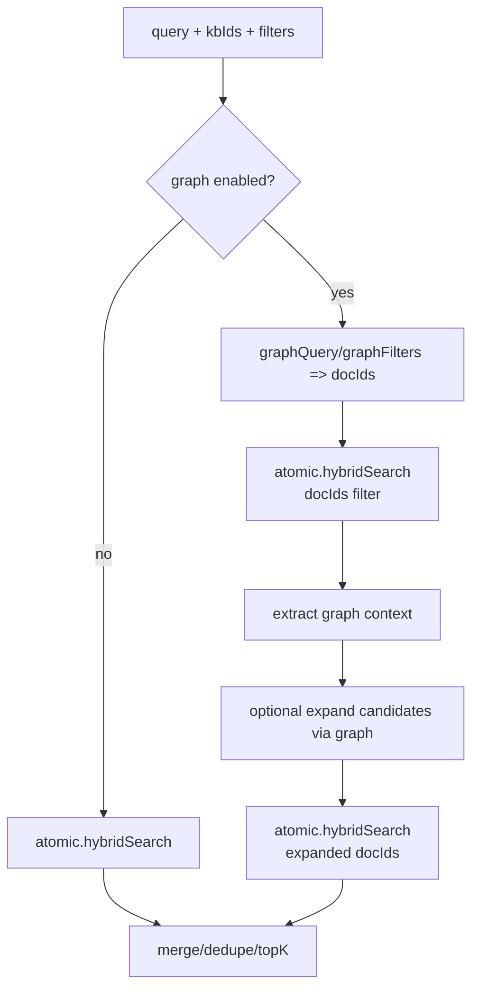

# 知识检索与 GraphRAG（knowledge-service）

本页以 `knowledge-service` 当前实现为准，描述：

- 知识存储模型（Document/Chunk）
- 原子检索（keyword/vector/hybrid）
- GraphRAG（GraphStore + 原子检索融合）
- 可选依赖（Elasticsearch/Neo4j）与降级策略
- seed 数据导入链路

## 1) 数据模型（核心）

knowledge-service 以 Postgres 为真源，核心实体包括：

- `KnowledgeBase`：知识库（可区分系统库/业务库；sys_* 也支持）
- `KnowledgeFile`：知识库中的文件（kb_id + file_id）
- `KnowledgeDocument`：统一文档（kb_id + document_id），承载 doc_type/title/metadata
- `KnowledgeChunk`：文档切片（chunk_index/section_id/content/metadata）

此外还包含结构化知识：

- 诉讼要素：`LitigationElement`
- 非诉清单：`NonLitigationChecklistItem`
- 要素映射：`ElementKnowledgeMapping`
- 案由画像：`CauseOfActionProfile`

## 2) 写入与索引（真源 + 可重建索引）

### 2.1 真源：Postgres（必选）

所有写入最终落到 Postgres（Flyway 管理 schema）。

典型写入入口（internal atomic）：

- `POST /api/v1/internal/atomic/batch-upsert`（批量写入 document + chunks）
- `POST /api/v1/internal/atomic/delete-by-file`（按 kb_id/file_id 删除）

（具体路由以 OpenAPI 为准）

### 2.2 可选索引：Elasticsearch（可选）

Elasticsearch 被视为“可重建索引”：

- 不影响真源写入（best-effort）
- ES 不可用时，检索自动降级为 SQL keyword/score

启用方式（环境变量）：

- `KNOWLEDGE_SEARCH_BACKEND=elasticsearch`
- `ELASTICSEARCH_URL=http(s)://...`

可选配置：

- `KNOWLEDGE_ES_INDEX`（默认 `knowledge_chunks_v1`）
- `OPENROUTER_API_KEY` / `OPENROUTER_BASE_URL`（用于生成向量 embedding）
- `KNOWLEDGE_EMBEDDING_MODEL` / `KNOWLEDGE_EMBEDDING_DIMS`

> 重要：当前“向量检索”走 Elasticsearch kNN + OpenAI 兼容 Embedding API（不是 Weaviate/Qdrant）。

## 3) 原子检索（Atomic Search）

internal atomic API（当前实现）：

- `POST /api/v1/internal/atomic/keyword-search`
- `POST /api/v1/internal/atomic/vector-search`
- `POST /api/v1/internal/atomic/hybrid-search`
- `POST /api/v1/internal/atomic/document`（获取文档聚合内容）
- `POST /api/v1/internal/atomic/section`（获取某 section 聚合内容）

执行逻辑（简化）：

1. 若 ES 启用且可用：走 ES keyword/vector/hybrid
2. 若 ES 不可用：降级为 SQL keyword 候选召回 + 简单打分

## 4) GraphRAG（GraphStore + Atomic）

GraphRAG 的目标是把“结构化约束/图谱扩展召回”叠加到原子检索上。

internal API：

- `POST /api/v1/internal/atomic/graph-query`
- `POST /api/v1/internal/atomic/graph-rag-search`

### 4.1 GraphStore（Neo4j，可选）

GraphStore 是可选依赖：

- `LEGAL_GRAPH_ENABLED=true|false`（默认 true）
- `NEO4J_URL` / `NEO4J_USER` / `NEO4J_PASSWORD` / `NEO4J_DATABASE`

未配置 Neo4j 时：

- GraphStore 退化为 Noop（fail-open）
- GraphRAG 会降级为“纯原子检索”

### 4.2 GraphRAG 的运行方式（简化）

## 5) Seed 导入（结构化与系统 KB 文档）

seed 数据通常由 `collector-service` 分发到 knowledge-service 的 internal seed API：

- `POST /api/v1/internal/seed/structured/import`
  - 诉讼要素 + 非诉 checklist
  - 可选同步到 Neo4j（若启用）
- `POST /api/v1/internal/seed/system-kb-documents/import`
  - 系统 KB 文档清单（供后续采集/索引/检索使用）
- `POST /api/v1/internal/seed/cause-of-action-profiles/import`

seed 包来源：

- `collector-service/resources/seed_packages/knowledge_structured_seeds`
- `collector-service/resources/seed_packages/knowledge_system_resources`

## 6) 与 ai-engine 的关系

ai-engine 的知识工具通常以 internal API 形式调用 knowledge-service：

- atomic search（keyword/vector/hybrid）
- graph-rag-search（当需要结构化扩展召回）
- element 工具（案由/要素相关 internal tool）

因此：

- knowledge-service 的 internal API 必须在 K8s 网络策略下可达
- internal api key（`X-Internal-Api-Key`）必须与集群内其它服务一致
