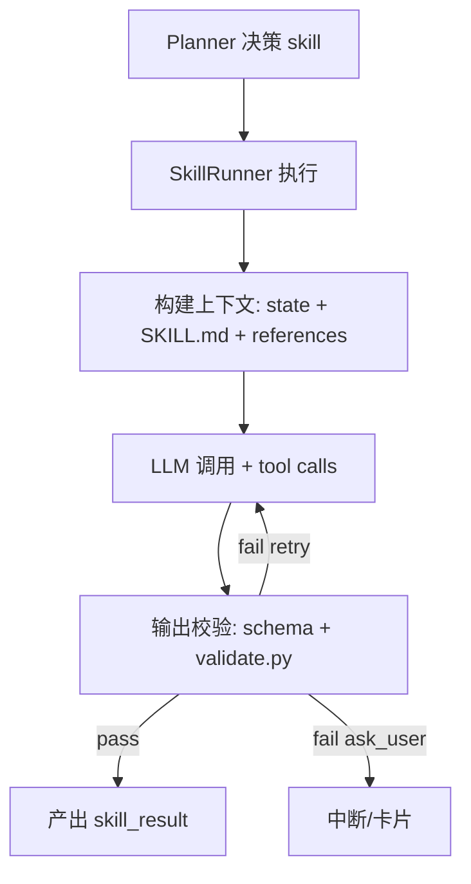

# Skill 技能系统（ai-engine）

本页以 `ai-engine` 当前实现为准，解释：

- Skill 在仓库中长什么样（目录结构）
- Skill 如何被选择与执行
- Skill 输出如何被强校验（不合法即失败）
- 如何触发“卡片中断（ask_user）”

## 1) Skill 的目录结构

`ai-engine` 的技能都在 `.skills/` 目录下，每个技能是一个目录：

```
ai-engine/.skills/<skill-name>/
  SKILL.md                # 提示词与业务规则（人读/可审查）
  skill.meta.json         # 机器可读元信息（触发/依赖/工具/模型配置）
  assets/output_schema.json  # 输出 schema（约束 data 字段；profile 字段由 provides 收敛）
  scripts/                # 可选：preprocess / postprocess / validate 等
  cases.yaml              # 可选：技能用例（回归/评测）
  references/             # 可选：知识参考（markdown，按 token 预算截断加载）
```

一个典型技能（示例：`litigation-intake`）具备：

- `skill.meta.json`：声明 tools、outputs.provides、execution_config(model/provider/temperature/...) 等
- `assets/output_schema.json`：声明 `data.*` 允许的字段与类型

## 2) skill.meta.json：声明式元信息

技能的核心元信息示例（摘录，具体以仓库为准）：

```json
{
  "name": "litigation-intake",
  "description": "诉讼案件受理：抽取当事人/事实/诉请/证据线索；信息不足则发起补问卡片。",
  "triggers": {
    "contexts": ["matter"],
    "state_conditions": ["state.profile.intake_status != 'completed'"]
  },
  "requires": {
    "all": ["state.matter_id != null"]
  },
  "tools": ["file__get_info", "file__parse", "element__extract"],
  "outputs": {
    "provides": [
      "profile.summary",
      "profile.plaintiff",
      "profile.defendant",
      "profile.facts",
      "profile.claims",
      "profile.intake_status"
    ]
  },
  "execution_config": {
    "provider": "openrouter",
    "model": "qwen/qwen3-32b",
    "temperature": 0.2
  }
}
```

关键点：

- `tools` 决定该技能允许调用哪些工具（tool handler）。
- `outputs.provides` 是 **profile 可写字段的单点真源**（禁止在 schema 漂移）。
- `execution_config` 决定该 skill 用哪个模型/网关与采样参数（按技能可差异化）。

## 3) output_schema.json：输出 schema（强收敛）

`assets/output_schema.json` 主要用于约束 `data` 部分（data 叶子字段），示例（摘录）：

```json
{
  "properties": {
    "data": {
      "properties": {
        "evidence_list": {
          "type": "array",
          "items": { "type": "object" }
        }
      }
    }
  }
}
```

实现上的收敛规则（重要）：

- `data` 字段：以 `output_schema.json` 为唯一真源
- `profile` 字段：以 `skill.meta.json.outputs.provides` 为唯一真源（加载 schema 时会把 profile.properties 重写为 provides 列表）

这能避免“提示词/文档更新导致写入字段漂移”，保证工作流门控（gate/checkpoints）不被悄悄破坏。

## 4) 统一输出契约：四段结构（无兜底）

每个技能最终必须输出一个 JSON 对象，且顶层必须且仅包含四段：

```json
{
  "response": "给用户/律师看的自然语言回复",
  "profile": { "..." : "画像增量（合并到 state.profile）" },
  "data":    { "..." : "业务数据增量（合并到 state 顶层字段）" },
  "control": {
    "action": "continue|retry|ask_user|finish",
    "review_type": "clarify|select|confirm|phase_done",
    "questions": [
      {
        "question": "问题文本",
        "field_key": "回填字段（支持点路径，如 profile.plaintiff.name）",
        "input_type": "text|select|multi_select|boolean|file_ids",
        "required": true,
        "options": [{"label": "选项", "value": "xxx"}]
      }
    ],
    "retry_prompt": "retry 时的重试提示"
  }
}
```

约束：输出不满足 schema/契约时，**技能直接失败**，外层不会做“自动修正/兜底拼接”。

## 5) 执行流程（简化）



校验链路（典型）：

1. `assets/output_schema.json`（通用结构校验）
2. `scripts/validate.py`（可选：业务规则校验；返回 continue/retry/ask_user）

## 6) 工具系统（tool handlers）

技能通过 tool calls 访问外部世界。当前常见工具前缀：

- `file__*`：文件信息/解析（对接 files-service）
- `matters__*`：事项读写（对接 matter-service）
- `knowledge__*`：知识检索（对接 knowledge-service）
- `element__*`：要素/案由相关的结构化能力（对接 knowledge-service internal element 工具）
- `memory__*`：记忆与事实（对接 memory-service）

每个技能可用哪些工具由 `skill.meta.json.tools` 显式声明。

## 7) ask_user：卡片中断的唯一入口

当技能需要用户/律师补充信息或做选择时：

- 技能输出 `control.action = "ask_user"`
- ai-engine 发出 `event=card`
- 上游（consultations-service）将其转发给前端
- 前端提交 `/resume` 后继续执行

协议与事件转发参见：`implementation/card-interaction.md`。

## 8) 测试与回归（ai-engine）

`ai-engine` 的 pytest markers（来自 `pyproject.toml`）：

- `L1`：Prompt 渲染测试
- `L2`：脚本逻辑测试
- `L3`：语义评估测试
- `integration`：需要真实 LLM 调用的集成测试

建议在变更 skills/playbooks 后至少跑 L1/L2，避免输出契约漂移导致流程卡死。
