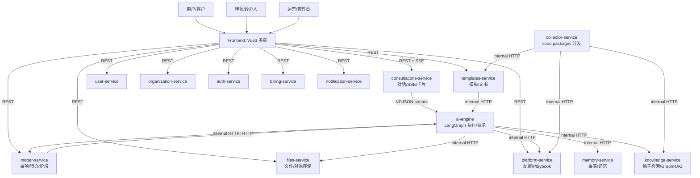
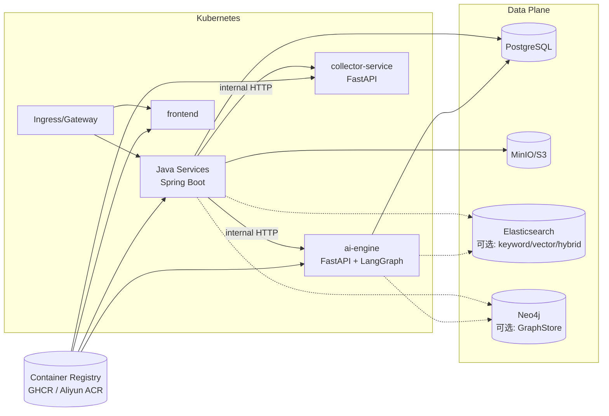

# LawSeekDog 技术文档

LawSeekDog 是一套「AI Agent 驱动的法律业务平台」的多仓库工程组。

- 业务微服务：Java 21 + Spring Boot（DDD 分层、Google REST、统一 `/api/**` 与 `/api/v1/internal/**` 边界）
- AI 引擎：Python + FastAPI + LangGraph（技能/Playbook 驱动、可中断的人机协同）
- 工程化：`ai-boot-framework`（脚手架/BOM/Starter/Archetype）+ `infra-templates`（统一 CI/CD）+ K8s/Helm

本网站内容以仓库现状为准；涉及“规划/待实现”的内容会明确标注，避免把旧实现/设想写成既成事实。

## 快速导航

- 架构
  - [系统架构概览](./architecture/overview.md)
  - [项目进度与现状](./architecture/progress.md)
  - [微服务拓扑与依赖](./architecture/microservices.md)
  - [数据流与协议（SSE/NDJSON/Internal API）](./architecture/data-flow.md)
  - [仓库结构与拆分映射（law_tools_agent → 多仓库）](./architecture/repositories.md)
- 业务流程
  - [咨询 → 事项（Consultation → Matter）](./flows/consultation-to-matter.md)
  - [诉讼 Playbook（示例：民事起诉）](./flows/litigation-workflow.md)
  - [非诉 Playbook（示例：合同审查）](./flows/non-litigation-workflow.md)
  - [Playbook 配置规范（v2）](./flows/playbook-phases.md)
- 核心实现
  - [Skill 技能系统（SKILL.md + output_schema + validate）](./implementation/skill-system.md)
  - [Planner 决策引擎（策略链 + LLM 兜底）](./implementation/planner-engine.md)
  - [卡片交互机制（ask_user / resume）](./implementation/card-interaction.md)
  - [知识检索与 GraphRAG（当前实现与边界）](./implementation/knowledge-rag.md)
  - [记忆服务（当前实现与规划）](./implementation/memory-extraction.md)
  - [Seed Packages（分发/导入/回归）](./implementation/seed-packages.md)
- API 与规范
  - [API 约定（Google REST + 统一返回体）](./api/conventions.md)
  - [认证与鉴权（JWT + Internal API Key）](./api/authentication.md)
  - [OpenAPI 与内部运维端点](./api/openapi.md)
- 部署与交付
  - [本地开发（单服务/多服务）](./deployment/local-dev.md)
  - [CI/CD（复用工作流 → 镜像构建/推送 + 可选 Helm 部署）](./deployment/ci-cd.md)
  - [Helm Chart（部署到 K8s）](./deployment/helm.md)
  - [生产部署要点（配置/密钥/依赖）](./deployment/production.md)

## 架构图（概览）

下面两张图用于快速理解系统形态；细节请看「架构」章节。

### 业务架构（面向用户/律师/运营）

（若本页未渲染 Mermaid，可到 GitHub 查看，或参考 `architecture/overview.md` 的 ASCII 兜底图。）

### 技术架构（运行时/部署视角）

