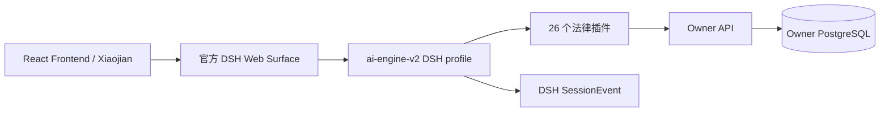

# LawSeekDog 技术文档

LawSeekDog 是面向律师工作的多仓库法律业务平台。当前运行时以**官方 DSH + `ai-engine-v2`**为唯一 Agent 控制面；业务状态由 Owner 服务持有，法律插件通过类型化 Tool 调用 Owner API。

## 当前主链路

```mermaid
flowchart LR
  FE[React Frontend / Xiaojian] --> DSH[官方 DSH Web Surface]
  DSH --> A[ai-engine-v2 DSH profile]
  A --> P[26 个法律插件]
  P --> O[Owner API]
  O --> DB[(Owner PostgreSQL)]
  A --> E[DSH SessionEvent]
```

`Session`、`SessionEvent`、`Approval`、`Question`、`Workflow`、`Subagent` 和 Replay 由 DSH 管理；Case、Matter、Document、File、Knowledge 等长期业务事实由对应 Owner 管理。旧 `ai-engine`、LangGraph workbench、consultations-service 和 Vue 前端属于历史资料，不是当前生产链路。

## 导航

- [项目总览与边界](./architecture/project-map.md)
- [架构概览](./architecture/overview.md)
- [微服务拓扑](./architecture/microservices.md)
- [数据流与协议](./architecture/data-flow.md)
- [业务流程](./flows/)
- [实现与契约](./implementation/)
- [部署与交付](./deployment/)

文档中的“当前”必须能由代码、Owner 契约或验收证据验证；旧设计请明确标注为历史。
